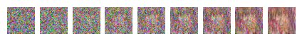
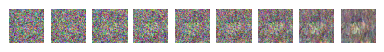

# Diffusion

DDPM implementation on [Anime Faces dataset](https://huggingface.co/datasets/huggan/anime-faces)

## Showcase

Some early epoch results

## TODO

- [ ] improve the noise schedule to destroy image slower (cosine was buggy)
- [x] double check training loop images (plot them)
- [x] can try using pretrained unet (seems to have better loss convergence)
- [ ] get my own UNET implementation working (currently the loss is not decreasing at all during training), most likely an issue with the residual connections
- [ ] tune hyperparameters for better convergence
- [ ] maybe use wandb to track experiments

## Resources

Explanation videos
- [Diffusion Models | Paper Explanation](https://www.youtube.com/watch?v=HoKDTa5jHvg)

diffusion implementation in pytorch
- [Diffusion Models | PyTorch Implementation](https://www.youtube.com/watch?v=TBCRlnwJtZU)
- [Diffusion models from scratch in PyTorch](https://www.youtube.com/watch?v=a4Yfz2FxXiY)
- [Diffusion Model from Scratch in Pytorch](https://towardsdatascience.com/diffusion-model-from-scratch-in-pytorch-ddpm-9d9760528946)
- [Annotated Diffusion](https://colab.research.google.com/github/huggingface/notebooks/blob/main/examples/annotated_diffusion.ipynb#scrollTo=51d9a24c)

position encoding in transformer models
- [a gentle introduction to positional encoding](https://machinelearningmastery.com/a-gentle-introduction-to-positional-encoding-in-transformer-models-part-1/)

papers
- [original DDPM paper](https://arxiv.org/pdf/2006.11239)
- [DDPM beat GANs on image synthesis](https://arxiv.org/pdf/2105.05233)
- [DDPM improved](https://arxiv.org/pdf/2102.09672)

