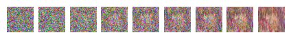
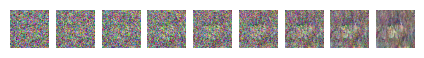

# Diffusion

DDPM implementation on Anime Faces dataset

[dataset](https://huggingface.co/datasets/huggan/anime-faces)

## Showcase

Some early epoch results

## TODO

- [ ] improve the noise schedule to destroy image slower (cosine was buggy)
- [x] double check training loop images (plot them)
- [x] can try using pretrained unet (seems to have better loss convergence)
- [ ] get my own UNET implementation working (currently the loss is not decreasing at all during training), most likely an issue with the residual connections
- [ ] tune hyperparameters for better convergence
- [ ] maybe use wandb to track experiments

## Resources

Explanation videos
https://www.youtube.com/watch?v=HoKDTa5jHvg
https://www.youtube.com/watch?v=TBCRlnwJtZU

diffusion implementation in pytorch
https://www.youtube.com/watch?v=a4Yfz2FxXiY
https://towardsdatascience.com/diffusion-model-from-scratch-in-pytorch-ddpm-9d9760528946
https://colab.research.google.com/github/huggingface/notebooks/blob/main/examples/annotated_diffusion.ipynb#scrollTo=51d9a24c

position encoding in transformer models
https://machinelearningmastery.com/a-gentle-introduction-to-positional-encoding-in-transformer-models-part-1/

DDPM paper
https://arxiv.org/pdf/2006.11239

DDPM beat GANs on image synthesis paper
https://arxiv.org/pdf/2105.05233

ddpm improved
https://arxiv.org/pdf/2102.09672

